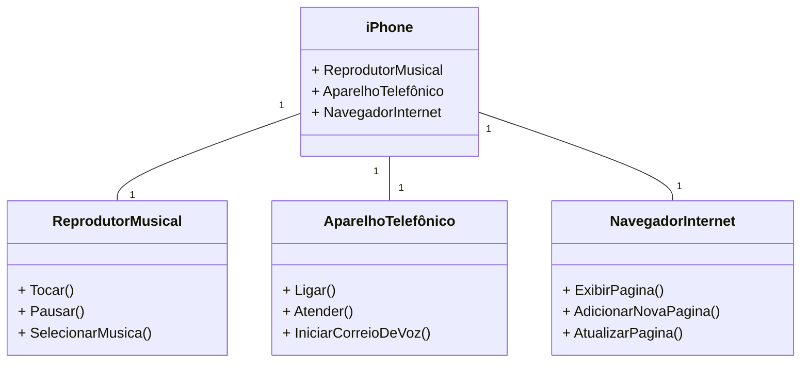

## Iphone System

```mermaid
classDiagram
  class iPhone {
    + ReprodutorMusical
    + AparelhoTelefônico
    + NavegadorInternet
  }

  class ReprodutorMusical {
    + Tocar()
    + Pausar()
    + SelecionarMusica()
  }

  class AparelhoTelefônico {
    + Ligar()
    + Atender()
    + IniciarCorreioDeVoz()
  }

  class NavegadorInternet {
    + ExibirPagina()
    + AdicionarNovaPagina()
    + AtualizarPagina()
  }

  iPhone "1" -- "1" ReprodutorMusical
  iPhone "1" -- "1" AparelhoTelefônico
  iPhone "1" -- "1" NavegadorInternet
```
